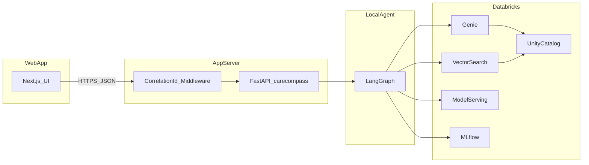
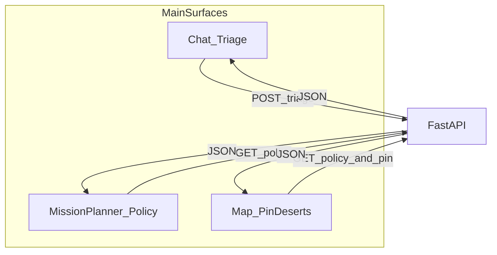

# agent.md — CareCompass Frontend (Hack Nation: Serving a Nation / Databricks Track)

This document is the **authoritative implementation guide** for a teammate building the **web frontend** for CareCompass. It is written to be paste-friendly into **Cursor, Copilot, or Codex**: follow phases in order, implement contracts exactly, and wire every screen to the **existing FastAPI** backend in this repository.

> **Inspiration:** The structure (mission, rubric, architecture diagrams, wireframes, demo script, phased definition-of-done) mirrors the depth of [`reference/Medical-Intelligence-Agent/AGENT.md`](reference/Medical-Intelligence-Agent/AGENT.md), but this repo’s UI target is a **TypeScript + React/Next.js** app calling **`backend_api`**, not Streamlit.

---

## 1. Mission and context

### Problem

Build a **credible, planner-ready, citation-backed** experience for **India healthcare facility intelligence**: triage (capability matching, not diagnosis), policy analytics (medical deserts, PIN risk), optional SMS referral, and **web-search enrichment** for contact details — all against **Databricks** (Genie, Vector Search, model serving) via the local **LangGraph** agent.

### Challenge document

- [Challenge PDF (local)](docs/pdfs/challenge-03-serving-a-nation.pdf)
- [Knowledge transfer / demo script](docs/KNOWLEDGE_TRANSFER.md)
- [Reverse-engineering playbook](docs/HACKATHON_REVERSE_ENGINEERING_PLAYBOOK.md)
- [Backend integrations (Twilio, Tavily)](docs/BACKEND_INTEGRATIONS.md)
- [Root README](README.md)

### Evaluation criteria (rubric alignment)

| Criterion | Weight | What the frontend should make *visible* |
|-----------|--------|----------------------------------------|
| **Technical accuracy** | **35%** | Citations, trust signals, non-guessy displays; show **degraded** state when a component is down; optional link to **MLflow** traces in Databricks for the same `correlation_id` |
| **IDP innovation** | **30%** | Rich rendering of `extraction_result` / structured synthesis when present in match responses; evidence tables, not a wall of text |
| **Social impact** | **25%** | Map + desert/PIN story: specialty selection, **desert** lists/overlays, “where it hurts” narrative |
| **User experience** | **10%** | Three-surface layout (Chat / Mission Planner / Map), one-click **example queries**, clear loading and errors, tablet-friendly |

> UX is listed as **10%** in the reference `AGENT.md` rubric; your internal docs may vary slightly—design for all four rows regardless.

### India dataset and backend

This codebase targets **Unity Catalog** tables and services configured via [`.env.example`](.env.example) (`DATABRICKS_*`, `GENIE_SPACE_ID`, `VECTOR_SEARCH_*`, `LLM_ENDPOINT`, etc.). The **frontend does not** hold Databricks tokens; it only talks to **FastAPI**.

---

## 2. Architecture overview

### System context



### What runs where

| Layer | Process | Tech |
|-------|---------|------|
| **UI** | Browser / Node dev server | Next.js, TypeScript, Tailwind, map library |
| **API** | `uvicorn backend_api.main:app` | FastAPI, Pydantic, CORS, `X-Request-Id` |
| **Agent + tools** | Same Python process as API | LangGraph, Databricks SDK, optional Twilio, Tavily |

### Three main UI areas (product shape)

This matches the **winning pattern** in internal docs: not chat-only.



| Surface | Primary endpoints | User goal |
|---------|------------------|-----------|
| **Chat (Triage)** | `/triage/*` | Symptom text → capabilities → **match facilities** with citations |
| **Mission Planner** | `/policy/*`, `/readiness` | Specialty → desert state/PIN, Wilson intervals, “where to prioritize” |
| **Map** | Policy + (optional) derived markers | Geospatial **social impact** story; desert overlays |
| **Referral / enrichment** | `/referral/*`, `/enrichment/*` | Preview SMS, show `mode`; enrich contact from Tavily with disclaimers |

---

## 3. Backend API contract (complete reference)

**Base URL:** configurable (e.g. `http://127.0.0.1:8000` in dev). All paths below are **relative to that origin**.

**Run the server (from repo root):**

```bash
uvicorn backend_api.main:app --reload
```

**OpenAPI:** `GET /openapi.json` — generate TypeScript types with `openapi-typescript` or similar if desired.

### 3.1 Correlation ID

- Middleware reads **`X-Request-Id`** (if present) or generates one.
- Responses may include a **`correlation_id`** field (also useful for **MLflow** lookup in the Databricks UI).
- **Client recommendation:** on each request, set `X-Request-Id: <uuid>` (or propagate the last `correlation_id` from the previous response) so support and traces line up with screenshots.

**Example header:**

```http
X-Request-Id: 550e8400-e29b-41d4-a716-446655440000
```

### 3.2 Citation object shape

Backend citations align with `CitationRecord` in [`src/citations.py`](src/citations.py). Treat all keys as **optional** in the UI; render what exists.

| Field | Type | Description |
|-------|------|-------------|
| `source` | string | e.g. `genie`, `vector_search`, `synthesis` |
| `facility` | string | Facility name if applicable |
| `field` | string | Column or logical field |
| `evidence_snippet` | string | Short evidence (truncated server-side) |
| `confidence` | number | 0..1 when present |
| `row_id` | string | Table row / id if applicable |
| `correlation_id` | string | Request id |

### 3.3 Safety disclaimer strings (exact)

Use these **verbatim** where noted so the app stays aligned with backend/legal framing.

| Context | String |
|---------|--------|
| **Triage** (`TriageSessionResponse` default / analyze) | `This is a capability-matching triage assistant, not a medical diagnosis. Seek emergency care if you have life-threatening symptoms.` |
| **Match** (`/triage/match_facilities`) | `Capability match / triage assistant only — not a medical diagnosis. In emergencies, seek immediate in-person care.` |
| **Policy** (`/policy/*`) | `Policy / coverage analytics — not clinical guidance.` |

Show **triage** disclaimers on chat/analyze; show **match** disclaimer prominently on the facility match view; show **policy** disclaimer on Mission Planner and map when policy data is shown.

### 3.4 Error patterns

- **HTTP errors:** FastAPI returns JSON `{ "detail": "..." }` for many failures (e.g. 404, 400, 503).
- **Logical errors:** e.g. `/triage/match_facilities` may return **200** with `{ "error": "session not found", "status": 404, ... }` — **the UI must branch on `error` / `status`, not only HTTP status.**
- **Enrichment:** `POST /enrichment/facility` may return **503** if `TAVILY_API_KEY` is missing (message in `detail`).

---

### 3.5 Endpoint reference

#### `GET /healthz`

**Response (200):**

```json
{
  "ok": true,
  "service": "carecompass",
  "integrations": {
    "twilio": { "configured": true, "from_set": true },
    "tavily": { "configured": true }
  }
}
```

Use for a **status pill** in the shell (do not print secrets). `twilio` / `tavily` are booleans for “likely to work,” not a guarantee of SMS to every country.

#### `GET /readiness`

**Response (200):** aggregated checks for Databricks components (workspace, warehouse, Genie, Vector Search, LLM).

Shape:

```json
{
  "ok": false,
  "status": "degraded",
  "degraded_components": ["vector_search_ping"],
  "checks": [
    { "component": "workspace_auth", "ok": true, "detail": "user=..." },
    { "component": "warehouse_query", "ok": true, "detail": "SELECT 1 succeeded" },
    { "component": "genie_ping", "ok": true, "detail": "..." },
    { "component": "vector_search_ping", "ok": false, "detail": "..." },
    { "component": "llm_ping", "ok": true, "detail": "..." }
  ]
}
```

**UI:** If `ok` is false, show a **non-blocking** banner: “System degraded: …” listing `degraded_components` and short `detail` on expand. Still allow the user to try triage (graph may surface its own `warnings`).

#### `POST /triage/analyze`

**Request body (`TriageAnalyzeRequest`):**

| Field | Type | Required | Notes |
|-------|------|----------|--------|
| `symptoms_text` | string | yes | min length 1 |
| `metadata` | object | no | **Accepted but ignored** by the server today; safe to send for future use |

**Response (`TriageSessionResponse`):**

| Field | Type | Description |
|-------|------|-------------|
| `session_id` | string | **Persist** for match + referral |
| `status` | string | e.g. `analyzed` |
| `capabilities_needed` | string[] | Tokens for mission language |
| `red_flags` | string[] | Show prominently (not “diagnosis”) |
| `query_used` | string | The graph query derived from symptoms |
| `safety_disclaimer` | string | Default string unless overridden |
| `graph_summary` | string or null | Truncated `final_answer` from the graph (markdown-ish) |
| `correlation_id` | string | Propagate |
| `citations` | object[] | Citation list |
| `degraded_components` | string[] | **Banner** if non-empty |
| `warnings` | string[] | **Banner** if non-empty |

#### `GET /triage/{session_id}`

**Response:** `TriageSessionResponse` with `status: "ok"` and cached `capabilities_needed`, `red_flags`, `query_used` — **no** `graph_summary` / citations from cache in the current implementation.

**Errors:** 404 with `detail: "Session not found"` if expired (sessions are in-memory on the **API process**; restarting the server clears them).

#### `POST /triage/match_facilities`

**Request body (`TriageMatchRequest`):**

| Field | Type | Default | Description |
|-------|------|---------|-------------|
| `session_id` | string | required | From `/triage/analyze` |
| `top_k` | int | 10 | Max facilities to ask the graph to list |
| `state_hint` | string or null | null | e.g. `Bihar` to bias the query |

**Response (success):** a **JSON object** that **spreads the full LangGraph result** (same keys as agent state) **plus** at least:

| Field | Type | Description |
|-------|------|-------------|
| `safety_disclaimer` | string | Match-specific disclaimer (see §3.3) |
| `graph_summary` | string or null | Truncated `final_answer` |
| `degraded_components` | string[] | From graph / tools |
| `warnings` | string[] | User-visible warnings |
| `correlation_id` | string | If present in graph output |

**Agent state keys** the UI should handle when present (names from [`src/state.py`](src/state.py)):

- `query`, `intents`, `sql_result`, `search_result`, `extraction_result`, `trust_result`, `geo_result`, `final_answer`, `citations`, `trust_artifacts`, `synthesis_artifacts`, `degraded_components`, `warnings`, `correlation_id`

**Response (session missing):**

```json
{
  "error": "session not found",
  "status": 404,
  "correlation_id": "...",
  "safety_disclaimer": "...",
  "citations": []
}
```

#### `GET /policy/deserts`

**Query parameters:**

| Param | Default | Description |
|-------|---------|-------------|
| `specialty` | `emergency` | Specialty token / label as used by backend |
| `level` | `pin` | `pin` or `state` |

**Response (200):** includes `specialty`, `level`, `desert_states`, `desert_pins`, counts, `desert_pin_ratio_interval` (Wilson / stats object—render `point`, `low_95`, `high_95` if present), `citations`, `safety_framing`, `correlation_id`, etc. See [`backend_api/services/policy_service.py`](backend_api/services/policy_service.py).

#### `GET /policy/pin-risk/{pin_code}`

- **Path:** 6-digit PIN (string). Invalid PIN → **400** with `detail` message.
- **Response (200):** `pin_code`, `facility_count`, `high_trust_wilson`, `sample_facilities`, `contrast_reasons`, `citations`, `safety_framing`, `correlation_id`.

#### `POST /referral/preview`

**Request (`ReferralPreviewRequest`):**

| Field | Type | Description |
|-------|------|-------------|
| `session_id` | string | Triage session id |
| `to_facility` | string | Target facility name |
| `patient_summary` | string | optional |
| `message_body` | string | optional; preview body |
| `contact_hint` | string | optional; may be phone for `tel:` action |
| `to_phone` | string | **E.164** recommended for real SMS (e.g. `+91...`); see [`referral_service`](backend_api/services/referral_service.py) |

**Response (`ReferralPreviewResponse`):** `preview_id`, `subject`, `body`, `actions[]`, `metadata` (includes `to_phone` sanitized, `twilio_configured`).

**Actions:** items may have `label`, `action` (`copy` | `tel` | `send_sms`), `payload` and/or `href`. For `copy`, use `payload` as clipboard text. For `send_sms`, the next step is `POST /referral/send` with the returned `preview_id`.

#### `POST /referral/send`

**Request (`ReferralSendRequest`):**

| Field | Type | Description |
|-------|------|-------------|
| `preview_id` | string | From preview |
| `to_phone` | string | optional override; if empty, uses phone stored at preview time |

**Response (`ReferralSendResponse`):**

| Field | Type | Description |
|-------|------|-------------|
| `success` | boolean | |
| `audit_id` | string | Show in UI for audit trail |
| `message` | string | Human-readable |
| `mode` | string | `twilio` \| `mock` \| `mock_fallback` |
| `twilio_message_sid` | string or null | Set when real SMS |
| `provider_error` | string or null | Twilio or config errors |

**UI:** Always show `mode` and, if `mock_fallback`, show `provider_error` collapsed (user education: geo permissions, trial numbers, etc.).

#### `POST /enrichment/facility`

**Request (`EnrichmentFacilityRequest`):**

| Field | Type | Required |
|-------|------|----------|
| `facility_name` | string | yes |
| `district` | string | no |
| `state` | string | no |

**Response (200):** on success, includes `success: true`, `enrichment` (phones, websites, `hours_note`, `confidence_0_1`, etc.), `citations`, `correlation_id`. On failure, may return JSON with `success: false` or **503** if Tavily is not configured.

**UI:** Show **“verify before use”** — web-derived contact data is **heuristic**.

#### `POST /enrichment/batch`

**Request (`EnrichmentBatchRequest`):** `{ "items": [ { "name": "...", "district": "...", "state": "..." }, ... ] }` **max 20** items. Empty list → **400**.

**Response:** `{ "results": [ ... ], "correlation_id": "..." }` where each result matches per-facility enrichment shape from the service.

---

## 4. Tech stack and project structure

### Recommended stack

| Concern | Choice | Docs |
|--------|--------|------|
| Framework | **Next.js 16+ (App Router)** or React + Vite | [nextjs.org](https://nextjs.org/docs) |
| Language | **TypeScript** | |
| Styling | **Tailwind CSS** + **shadcn/ui** (Radix) | [ui.shadcn.com](https://ui.shadcn.com) |
| Maps | **Leaflet** + `react-leaflet` (no API key; OSM tiles) | [react-leaflet.js.org](https://react-leaflet.js.org) |
| Charts | **Recharts** or **Chart.js** | [recharts.org](https://recharts.org) |
| HTTP | `fetch` + thin typed wrapper; or **TanStack Query** | [tanstack.com/query](https://tanstack.com/query/latest) |
| Markdown | `react-markdown` + `remark-gfm` for `graph_summary` / `final_answer` | |

### Suggested `frontend/` layout

```
frontend/
  .env.local                 # NEXT_PUBLIC_CARECOMPASS_API_URL=http://127.0.0.1:8000
  app/
    layout.tsx
    page.tsx                 # or route groups per tab
    (main)/
      chat/page.tsx
      planner/page.tsx
      map/page.tsx
  components/
    shell/AppShell.tsx
    triage/AnalyzeForm.tsx
    triage/MatchPanel.tsx
    policy/DesertPanel.tsx
    policy/PinRiskCard.tsx
    map/IndiaMap.tsx
    citations/CitationTable.tsx
    system/DegradedBanner.tsx
    referral/ReferralDialog.tsx
  lib/
    api/
      client.ts              # base URL, X-Request-Id, parse errors
      triage.ts
      policy.ts
      referral.ts
      enrichment.ts
    types/
      agentState.ts         # optional: narrow known keys from match_facilities
  public/
  package.json
```

### Environment variables (frontend only)

```bash
# .env.local
NEXT_PUBLIC_CARECOMPASS_API_URL=http://127.0.0.1:8000
```

**Never** put Databricks tokens or Tavily keys in the frontend. Those stay on the **Python** server.

### CORS

Backend [`backend_api/main.py`](backend_api/main.py) already allows `allow_origins=["*"]` for dev. For production, tighten CORS in coordination with the deployment URL.

---

## 5. Phase 1 — Foundation and layout (MVP shell)

**Goal:** Running Next.js app with **3 tabs** (or 3 routes) and a **working API client** that displays `/healthz` and runs **one** successful `/triage/analyze`.

### Implementation checklist

- [ ] Create `frontend/` with TypeScript, Tailwind, and shadcn.
- [ ] `lib/api/client.ts`: `getJson`, `postJson`, set `X-Request-Id`, throw typed errors for HTTP + parse failures.
- [ ] `components/system/ServiceStatusBar.tsx`: poll `GET /healthz` and `GET /readiness` on a slow interval (30–60s) or on focus.
- [ ] **Chat page:** form with `symptoms_text` → `POST /triage/analyze` → show `session_id`, capabilities, red flags, and **markdown** for `graph_summary` if present.
- [ ] Show **`degraded_components`** and **`warnings`** with `DegradedBanner` if non-empty.
- [ ] **Persist `session_id`** in React state; optional `sessionStorage` for refresh resilience (document that server restart invalidates it).

### Phase 1 — Definition of done

- [ ] `pnpm dev` / `npm run dev` shows three surfaces (can be placeholder content for planner/map).
- [ ] Triage analyze returns 200 and renders capabilities + disclaimer.
- [ ] `correlation_id` visible in a dev-only “details” expander (helps MLflow demo).

---

## 6. Phase 2 — Core features (triage + policy + map)

**Goal:** Full **triage match**, **policy** views, and a **credible** map.

### 6.1 Triage match

- [ ] After analyze, add **“Find facilities”** → `POST /triage/match_facilities` with `session_id`, `state_hint` optional.
- [ ] Parse **both** HTTP errors and JSON `{ error, status: 404 }`.
- [ ] Render `graph_summary` / `final_answer` as markdown; render **citations** in `CitationTable`.
- [ ] If `trust_artifacts` / `synthesis_artifacts` exist, add a “Structured” accordion (JSON pretty or field-specific UI).
- [ ] Show match **`safety_disclaimer`** in a callout (distinct from analyze disclaimer).
- [ ] `top_k` slider (1–20) wired to the request.

### 6.2 Mission planner (policy)

- [ ] `GET /policy/deserts?specialty=...&level=pin|state` with dropdown for specialty (seed list: `emergency`, `cardiology`, `ophthalmology`, … + free text to match backend expectations).
- [ ] Show **desert** lists, counts, and **Wilson** interval with a short “how to read this” label.
- [ ] Display `safety_framing` at top: **Policy / coverage analytics — not clinical guidance.**
- [ ] `GET /policy/pin-risk/{pin}`: validate 6 digits client-side; show `sample_facilities` and confidence.
- [ ] **Charts:** e.g. bar for desert counts; pie optional—**do not** block on chart polish.

### 6.3 Map

- [ ] Center map on **India**; use Leaflet + OSM.
- [ ] If you have **lat/lon** in any API response, plot markers. If not available in a given response, use **state centroids** or a **choropleth placeholder** and label the limitation honestly.
- [ ] “Desert overlay”: represent **desert_states** / **desert_pins** from policy API (circles, pinned regions, or a side list + highlight). The **story** matters more than geospatial precision for the hackathon.
- [ ] Legend: facility types / desert overlay / trust coloring if data exists.

### Phase 2 — Definition of done

- [ ] End-to-end: analyze → match shows citations + match disclaimer.
- [ ] Policy tab shows a specialty-based desert report with safety framing.
- [ ] Map tab tells the **social impact** story with at least one clear visual of “gaps” (overlay or list-linked markers).

---

## 7. Phase 3 — Enrichment, referral, and polish

**Goal:** “Ops-ready” feel—referral, enrichment, example queries, responsive layout.

### 7.1 Referral

- [ ] From a selected facility, open **Referral** dialog: `POST /referral/preview` with `session_id`, `to_facility`, `patient_summary`, `to_phone`, `contact_hint`.
- [ ] Render `actions` from API (Copy / tel / send SMS).
- [ ] `POST /referral/send` with `preview_id` and optional `to_phone` override; display **`mode`**, `audit_id`, and errors.
- [ ] If `integrations.twilio` is false, pre-annotate UI: “SMS may be mock.”

### 7.2 Enrichment

- [ ] “Enrich from web” button → `POST /enrichment/facility` (and optional batch for compare).
- [ ] If **503** on missing Tavily, show a friendly “admin must set `TAVILY_API_KEY` on server.”
- [ ] Display **citations** and **confidence**; never show enrichment as “verified fact.”

### 7.3 Example queries (sidebar)

Wire **5 one-click** strings (triage **analyze** input). Examples (tune to India data):

1. *“Fever and difficulty breathing for 2 days; need emergency care near Patna”*
2. *“Painless vision loss; need ophthalmology workup”* 
3. *“Recurring chest pain; need cardiology and imaging capacity”* 
4. *“Fracture after fall; need orthopedics and OR capability”* 
5. *“List facilities that look inconsistent on equipment vs procedure claims in Bihar”* (drives trust / anomaly narrative—may route to `TRUST` in graph)

### 7.4 UX must-haves

- [ ] Loading skeletons for graph calls (5–20s is possible with Databricks).
- [ ] `try/catch` with toast + retry for network errors.
- [ ] Mobile / tablet: collapsible sidebar, sticky disclaimers.
- [ ] ARIA: buttons for actions, not `div` click handlers for critical flows.

### Phase 3 — Definition of done

- [ ] Referral path works end-to-end in at least `mock` mode; shows real `twilio` if configured.
- [ ] Enrichment works or degrades with a clear 503 path.
- [ ] Example queries + disclaimers in place.

---

## 8. Phase 4 — Demo hardening and stretch

**Goal:** Resilient **5-minute** demo, optional **PDF** and **MLflow** deep link.

- [ ] **Cache last successful** `match_facilities` and policy responses in `sessionStorage` (keyed by query hash) to recover from hiccups on stage.
- [ ] **Debounce** PIN input (300ms) before `pin-risk` fetch.
- [ ] **Lazy load** the map (dynamic import) to speed first paint.
- [ ] **PDF export:** use `jspdf` or `pdf-lib` to export **Mission Planner** summary (specialty, desert counts, timestamp, `correlation_id`, disclaimers). Optional stretch.
- [ ] **MLflow link:** if your team has a **fixed MLflow `experiment` URL** + trace search, add an optional “View traces” link that passes `correlation_id` as search text (or document manual steps in README). The backend does not return a direct URL; this is a **narrative** + ops convenience.
- [ ] **Accessibility:** color-blind safe status colors (use icons, not only red/green); WCAG focus rings on shadcn defaults.
- [ ] **i18n:** not required; English-only is OK for the hackathon.

### Phase 4 — Definition of done

- [ ] One “happy path” script works with **no** manual typing.
- [ ] A second path works with **at least one** simulated degradation (e.g. vector search down—banner visible).

---

## 9. Component wireframes (ASCII)

### Chat / Triage

```
+--------------------------------------------------------------------------------+
|  CareCompass                                        [Status: health / readiness] |
+--------------------------------------------------------------------------------+
|  Example queries (sidebar)     |  SYMPTOM INPUT (MULTILINE)                    |
|  [Q1] [Q2] [Q3]                 |  [_____________________________________]    |
|                                 |  [Analyze capabilities]  session: abc-123     |
|                                 |  CAPABILITIES:  emergencyMedicine, ...         |
|                                 |  RED FLAGS:    ...     (triage disclaimer)     |
|                                 |  [Match facilities]   state: [Bihar v]         |
|                                 |  OUTPUT (markdown) + Citations (table)          |
+--------------------------------------------------------------------------------+
```

### Mission Planner (policy)

```
+------------------------------------------------------------------+
|  Mission planner — POLICY / COVERAGE ANALYTICS (disclaimer)      |
|  [Specialty: emergency v]  level:  (o) pin  ( ) state            |
|  Desert states: ...........   Desert PINs: ........             |
|  Wilson interval:  [=======o-------]  (explain tooltip)         |
+------------------------------------------------------------------+
|  PIN RISK:  [ 800001 ]  [Lookup]                                 |
|  sample_facilities: table + high_trust_wilson                    |
+------------------------------------------------------------------+
```

### Map

```
+------------------------------------------------------------------+
|  MAP  +  Policy legend  +  "Desert overlay" toggles                |
|  [  ~ leaf map ~  ]     list of desert pins / states on side      |
+------------------------------------------------------------------+
```

### Referral modal

```
+------------------------------------------+
|  Refer to:  AIIMS Patna (example)         |
|  Phone: +91...........  [E.164 hint]     |
|  [Preview]  [Send SMS]  mode: --          |
|  audit_id: ........                      |
+------------------------------------------+
```

---

## 10. Demo script (5 minutes)

| Time | Action | UI surface | Judging angle |
|------|--------|------------|---------------|
| 0:00–0:40 | Intro problem + 3-surface UI | all | Social + UX |
| 0:40–1:30 | Example triage: analyze + match | Chat | Triage + citations |
| 1:30–2:30 | Pick specialty → desert / Wilson | Mission planner | Social impact + technical |
| 2:30–3:10 | Map overlay + what it means for patients | Map | Social impact |
| 3:10–3:50 | Optional referral preview + `mode` | Referral | Ops / integration |
| 3:50–4:30 | Enrich phone from Tavily (or show 503 handling) | Enrichment | IDP + trust narrative |
| 4:30–5:00 | Open Databricks **MLflow** with same `correlation_id` | (browser second tab) | Technical accuracy / audit trail |

**Closing line (suggested):** *“We turn messy facility evidence into action—where to go, what to distrust, and what gaps to close first.”*

---

## 11. Must-have queries (shortcuts)

| # | Shortcut label | Intended effect |
|---|----------------|-----------------|
| 1 | Emergency near capital | Triage + match + map zoom |
| 2 | Eye / vision | Specialty-driven desert |
| 3 | Cardiac symptoms | Triage + policy cardiology or generic |
| 4 | “Suspicious” facilities | Pushes **trust** / anomaly narrative |
| 5 | Desert + PIN | Policy `pin` level + `pin-risk` example |

(Adjust labels to your India dataset and judge story.)

---

## 12. Anti-patterns and risks

| Anti-pattern | Why it hurts |
|--------------|-------------|
| Chat-only UI | You leave **30–35%** of the “surface area” story (planner + map) on the table. |
| Hiding `degraded_components` / `warnings` | Judges won’t see **graceful degradation**—a strength of the backend. |
| Treating enrichment as ground truth | Violates **trust**; always show “verify” + citations. |
| Assuming SMS always works | Twilio **region / trial** issues → always surface `mode` and `provider_error`. |
| Hardcoding Databricks state in the browser | security failure; also unnecessary—the API abstracts tools. |
| Ignoring 200-with-`{error,status:404}` in match | User sees empty UI with no explanation. |

**Risks (known):** Vector index **schema drift** (backend prunes columns and warns); **Genie** may return awkward SQL; **first token load** to Databricks can be **slow**—use spinners and cached shortcuts.

---

## 13. Resources and links

**This repo**

- [README.md](README.md) — how to run API and tests
- [docs/BACKEND_INTEGRATIONS.md](docs/BACKEND_INTEGRATIONS.md) — Twilio, Tavily
- [docs/KNOWLEDGE_TRANSFER.md](docs/KNOWLEDGE_TRANSFER.md) — team narrative
- [backend_api/main.py](backend_api/main.py) — route list
- [backend_api/schemas.py](backend_api/schemas.py) — Pydantic types

**Reference (Streamlit, Ghana sample)**

- [reference/.../AGENT.md](reference/Medical-Intelligence-Agent/AGENT.md) — end-to-end agent doc / rubric (different dataset, same *demo shape*)

**Databricks (judges and MLflow deep dive)**

- [MLflow](https://docs.databricks.com/en/mlflow/index.html)
- [Genie](https://docs.databricks.com/en/genie/index.html)
- [Vector Search](https://docs.databricks.com/en/generative-ai/vector-search.html)

**UI**

- [Next.js](https://nextjs.org/docs)
- [Leaflet / react-leaflet](https://react-leaflet.js.org/docs/start-installation/)
- [shadcn/ui](https://ui.shadcn.com/docs)
- [TanStack Query](https://tanstack.com/query/latest)

---

## Quick commands (cheat sheet)

```bash
# Terminal A — API
cd /path/to/hack-nation
uvicorn backend_api.main:app --reload

# Terminal B — UI (after you create frontend)
cd frontend
npm install
npm run dev
```

**Health checks:**

```bash
curl -s http://127.0.0.1:8000/healthz | jq .
curl -s http://127.0.0.1:8000/readiness | jq .
```

---

**You are done when** all four **phase definitions of done** are satisfied, the app never implies **diagnosis**, and any live judge can run **Chat → Policy → Map** in under five minutes with **citations and disclaimers** visible throughout.
